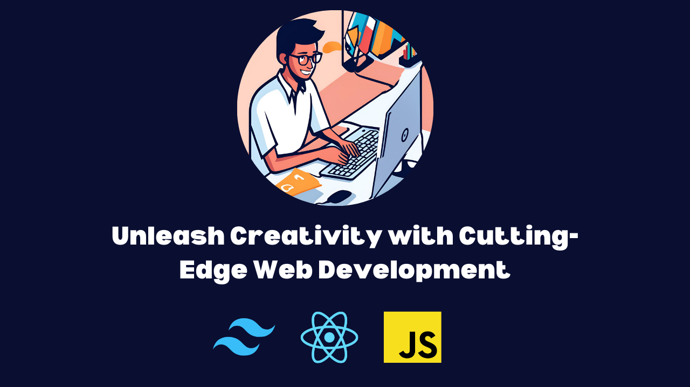

# 🌟 **Ahnaf Tahmid**  

  

## 👨‍💻 **About Me**  
Hi there! I'm **Ahnaf Tahmid**, a **frontend developer** passionate about crafting seamless and visually appealing web experiences. With a focus on **clean code** and **user-centric design**, I aim to bring innovative ideas to life on the web.  

---

### 🌱 **Current Focus**  
- 🔍 Exploring **advanced React.js patterns** for scalable applications.  
- 🎨 Building **responsive, accessible, and user-friendly interfaces**.  
- 🛠 Integrating **cutting-edge technologies** like TanStack Query and Firebase.  
- 🤝 Contributing to **open-source communities** and collaborating on exciting projects.  

---

### 📊 **GitHub Stats**  

  
  

---

### 🛠 **Skills & Technologies**  

#### **Languages**  
  
  
  
  

#### **Frameworks & Libraries**  
  
  
  
  

#### **Databases & Backend**  
  
  
  

#### **Design & Tools**  
  
  
  
  

---

### 🎯 **What Drives Me?**  
- 💡 The thrill of debugging complex UI bugs and finding elegant solutions.  
- 🚀 Participating in **hackathons** to push boundaries and learn from peers.  
- 🌍 Experimenting with **emerging web technologies** to stay ahead of the curve.  

---

### 📫 **Connect With Me**  
- 💼 [LinkedIn](https://linkedin.com/in/ahnaftahmid)  
- 🐦 [Twitter](https://twitter.com/ahnaftahmid)  
- 🌐 [Portfolio](https://ahnaftahmid.dev)  

---

### 🌌 **Let’s Build Something Amazing Together!**  
From brainstorming ideas to deploying polished applications, I’m always excited to collaborate and learn. Let’s create a digital impact! 🚀  
